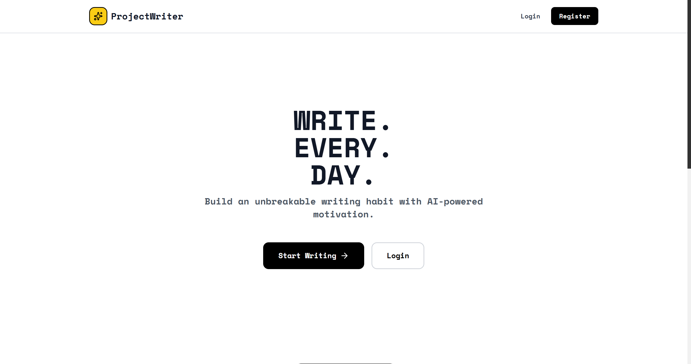

# WriteFlow - AI-Powered Writing Platform

> A full-stack web application that helps writers stay focused and productive with custom AI coaching, performance analytics, and community engagement.

[](https://github.com/agim-jr/writeflow)
[](https://www.python.org/)
[](https://react.dev/)
[](https://fastapi.tiangolo.com/)



## Project Overview

WriteFlow is a comprehensive writing platform designed to solve common writer challenges: maintaining focus, tracking progress, and staying motivated. The application combines modern web technologies with a custom rule-based AI system to create an engaging, distraction-free writing experience.

** [View Screenshots](#-screenshots)**

---

## Key Features

### Smart Writing Environment
- **Multiple Writing Modes**: Timed sessions (25/45 min), Sprint mode, Focus mode with real-time countdowns
- **Real-time Analytics**: Live word count, WPM tracking, and writing streak visualization
- **Auto-save & Export**: Seamless auto-saving with TXT, Markdown, and HTML export options
- **Distraction-Free Interface**: Clean, modern UI built with React and Tailwind UI

### Custom Rule-Based AI Writing Coach
- **Real-time Motivation**: Context-aware encouragement based on writing patterns
- **Writer's Block Detection**: Intelligent pattern analysis with personalized nudges
- **Milestone Celebrations**: Gamified achievements for hitting word count goals
- **Adaptive Coaching Styles**: Choose from Cheerleader, Taskmaster, Philosopher, or Comedian personas
- **Privacy-First**: All AI processing happens locally on your server (no external API dependencies)

### Analytics & Progress Tracking
- **Writing Streaks**: Visual streak tracking with calendar heatmaps to maintain momentum
- **Performance Metrics**: Detailed WPM analysis, pause patterns, and editing behavior insights
- **Session History**: Comprehensive statistics with interactive Recharts visualizations
- **Daily Goals**: 250-word minimum with progress indicators and achievement badges

### Community Features
- **Share Your Work**: Post your writing (one per day after meeting 250-word goal)
- **Engage with Others**: Like and comment system for community interaction
- **Motivational Feed**: Stay inspired by fellow writers' achievements and posts

---

## Tech Stack

### Frontend
- **React 18** - Modern UI with hooks and functional components
- **React Router v6** - Client-side routing with protected routes
- **Tailwind CSS** - Utility-first styling framework
- **Tailwind UI** - Premium component library for polished interface
- **Lucide React** - Consistent icon system
- **Recharts** - Interactive data visualization for analytics
- **Axios** - HTTP client with interceptors for JWT handling

### Backend
- **FastAPI** - High-performance async Python web framework
- **SQLAlchemy** - ORM with relationship management
- **PostgreSQL** - Relational database (also supports SQLite for development)
- **JWT (python-jose)** - Secure token-based authentication
- **Bcrypt** - Password hashing
- **Custom Rule-Based AI** - Intelligent writing coach with pattern recognition
- **Alembic** - Database migration management
- **Pydantic** - Data validation and settings management

### DevOps & Development Tools
- **Git** - Version control
- **Python Virtual Environment** - Dependency isolation
- **npm** - Frontend package management
- **ESLint** - JavaScript linting

---

## Getting Started

### Prerequisites
```bash
Python 3.11+
Node.js 18+
PostgreSQL 14+ (or SQLite for development)
